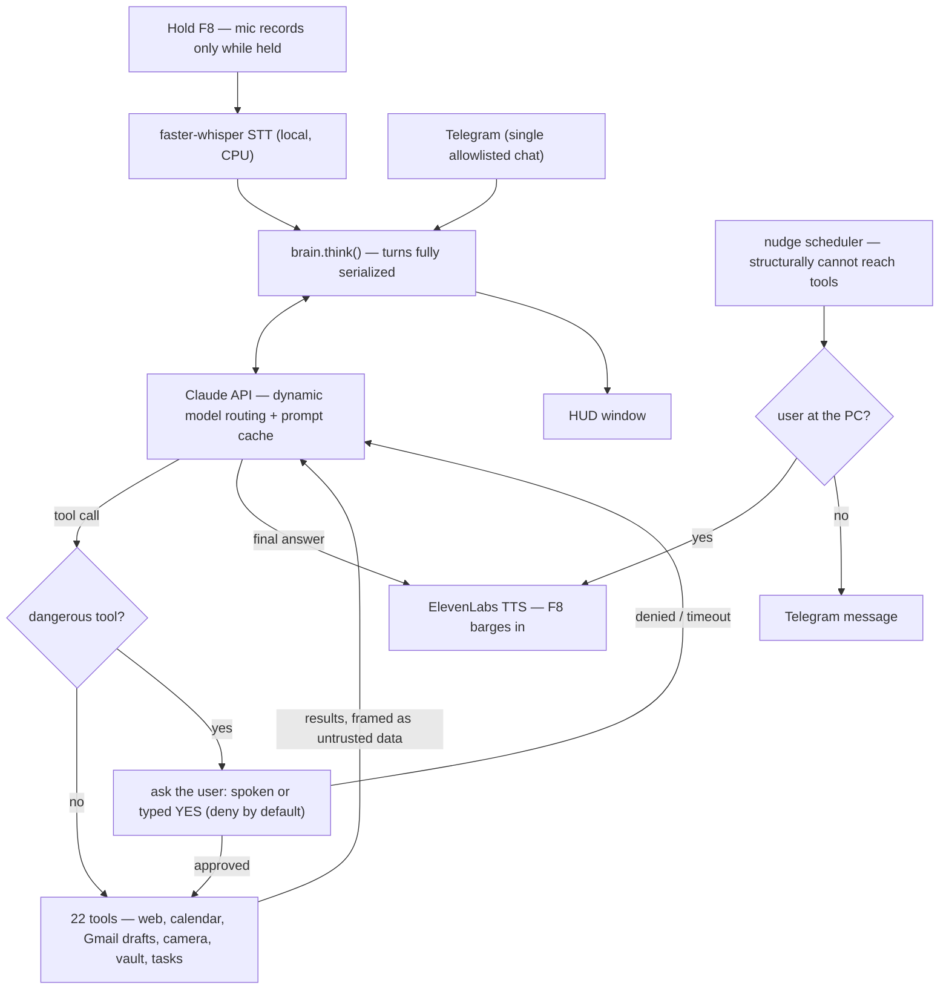

[](https://github.com/DECLANMACGREGOR/jarvis/actions/workflows/tests.yml)

# J.A.R.V.I.S. — a local push-to-talk voice agent

<!-- Media: drop files into docs/ then uncomment. Keep demo.gif under ~10 MB.


|  |  |  |
|:--:|:--:|:--:|
| The HUD mid-response | Deny-by-default permission gate | Same gate over Telegram |
-->


A locally-running, private, Iron Man-style voice assistant for Windows. Hold a key, speak, release — JARVIS transcribes locally, thinks with Claude, acts through a permission-gated toolset, and answers out loud in a British voice, with a floating HUD tracking every turn.

> Speech-to-text is fully local and the mic is only open while the key is held. The only data that leaves the machine is the text sent to the Claude and ElevenLabs APIs, plus the tool calls you approve.

## Architecture



## Features

- **Push-to-talk, no wake word** — the mic records only while `F8` is held. No ambient listening, ever.
- **Barge-in** — holding PTT while JARVIS speaks cuts the response off immediately and cancels the remaining TTS fetches.
- **Dynamic model routing** — everyday turns run on a fast Claude model; requests that need heavy reasoning ("think hard", coding, analysis) auto-escalate to a stronger one. Prompt caching plus auto-summarization every 20 turns keep token usage flat over long sessions.
- **Tools** — web search (DuckDuckGo), open apps/files, run Python/shell, persistent memory, Obsidian vault read/search/write, webcam capture with local face recognition, Google Calendar, Gmail read + draft, user-initiated task reminders, morning briefing (weather + calendar).
- **Vision** — one-shot webcam capture (OpenCV) with YuNet + SFace face recognition, entirely on-CPU. Only 128-float embeddings are stored — never photos.
- **Second channel: Telegram** — text JARVIS from a phone; same brain, same tool gates, single-chat allowlist.
- **Nudges** — a background scheduler reminds you about your tasks at 24h / 3h / overdue, routed to speakers if you're at the PC or Telegram if you're not.
- **HUD** — a floating tkinter window with live status, the current exchange, and an animated arc reactor. (`hud_v2_neural_mockup.py` is a standalone PyQt6 design mockup for the next-generation HUD.)

## Safety design

This project treats a tool-using voice agent as an untrusted-input problem, and the guardrails are structural rather than prompt-only:

- **Permission gate on dangerous tools.** `run_code`, `open_item`, vault writes, and calendar deletes require an explicit spoken *yes* (or a typed `YES` over Telegram) before executing — deny by default, timeout = deny, and the request always states what will actually run.
- **Draft-only email, enforced in code.** No function that can send email exists in the codebase; JARVIS can only create Gmail drafts for human review.
- **Structural no-tools guarantee for reminders.** The nudge scheduler composes reminders from pure string templates and its import graph cannot reach the model or the tool dispatcher — it is architecturally incapable of acting on a task.
- **Untrusted-data framing.** Web search results and email bodies are wrapped as data-not-instructions before the model sees them, cutting off the prompt-injection → code-execution path.
- **Allowlisted Telegram.** One hardcoded chat ID; every other sender is silently dropped before any processing.
- **Audible side effects.** Camera captures, memory writes, calendar creates, and email drafts are announced out loud — nothing real-world happens silently.
- **Sandboxed vault access.** Vault tools resolve paths against the vault root and refuse anything that escapes it.

## File map

| File | Role |
|------|------|
| `main.py` | Entry point — the PTT → listen → think → speak loop |
| `listener.py` | Push-to-talk key detection + mic recording |
| `stt.py` | faster-whisper speech-to-text (local, CPU) |
| `brain.py` | Claude orchestration: routing, tool loop, auto-summarize |
| `voice.py` | ElevenLabs TTS, sentence-chunked streaming, barge-in |
| `tools.py` | Tool schemas + implementations, permission gate |
| `google_tools.py` | Google Calendar + Gmail (read/draft only) |
| `briefing.py` | Morning briefing: datetime, weather, calendar |
| `vision.py` | Webcam capture + YuNet/SFace face recognition |
| `memory.py` | Persistent JSON memory (facts + summary) |
| `tasks.py` | User-initiated task/reminder store |
| `nudge.py` | Background deadline-reminder scheduler |
| `presence.py` | At-the-PC heuristic for reminder routing |
| `telegram_io.py` | Telegram text channel (allowlisted) |
| `hud.py` | Tkinter HUD |
| `config.py` | Settings; secrets and locations via `.env` |

## Setup

Windows-only (uses `winreg`, `os.startfile`, and the `keyboard` package). Requires Python 3.12+.

```powershell
git clone https://github.com/DECLANMACGREGOR/jarvis.git
cd jarvis

# Create the venv at a SHORT path — some deps have filenames long enough
# to hit Windows' 260-char path limit in a deeply nested folder.
python -m venv C:\jv
C:\jv\Scripts\pip install -r requirements.txt

# Configure keys, then run
copy .env.example .env      # fill in ANTHROPIC_API_KEY + ELEVENLABS_API_KEY
C:\jv\Scripts\python main.py
```

Notes:

1. **First run** downloads the Whisper model (~150 MB, one time); the two face-recognition ONNX models download on first camera use. If startup looks stalled, it's downloading.
2. **Optional — Telegram**: create a bot with @BotFather, get your numeric user id from @userinfobot, add both to `.env`. Leave blank to run voice-only.
3. **Optional — Google**: create an OAuth desktop client in Google Cloud Console with the Calendar + Gmail APIs enabled, save it as `credentials.json` in the project root, then run `C:\jv\Scripts\python google_tools.py` for a one-time browser consent and self-test.
4. **Verify the install** (optional): `C:\jv\Scripts\pip install -r requirements-dev.txt`, then `C:\jv\Scripts\python -m pytest` — 30 tests should pass.

## Usage

- Hold **F8** (configurable via `PTT_KEY` in `config.py`), speak, release.
- Interrupt JARVIS at any time by holding F8 while it speaks.
- Try: *"what's on my calendar tomorrow?"*, *"search my vault for interview prep"*, *"remind me to submit the form by Friday 5pm"*, *"who's on camera?"*, *"morning briefing"*.
- Say *"think hard"* to force escalation to the stronger model.

## Privacy

- STT is local; audio never leaves the machine.
- No ambient listening — the mic is open only while PTT is held.
- Face recognition stores embeddings only (not reconstructable into images), locally.
- Memory, tasks, tokens, and enrolled faces live in the gitignored `memory/` directory.
- Home coordinates and vault path are configured through `.env`, not committed.

## Tests

The safety-critical pure logic is covered by pytest — TTS chunking edge cases, reminder stage thresholds, confirmation-word matching ("no" must not match inside "notepad"), and vault path-escape refusal:

```powershell
pip install -r requirements-dev.txt
pytest
```

CI runs the suite on every push ([tests.yml](.github/workflows/tests.yml), Windows runner).

## Roadmap

- **Reel-to-AI** (in progress on a feature branch): a Gmail-fed queue that turns saved Instagram reels into extracted, versioned agent skills via yt-dlp + vision.
- HUD v2 — wire the Neural Constellation mockup to live brain/tool events.
- Voice cloning for a closer JARVIS timbre.

## License

[MIT](LICENSE)
